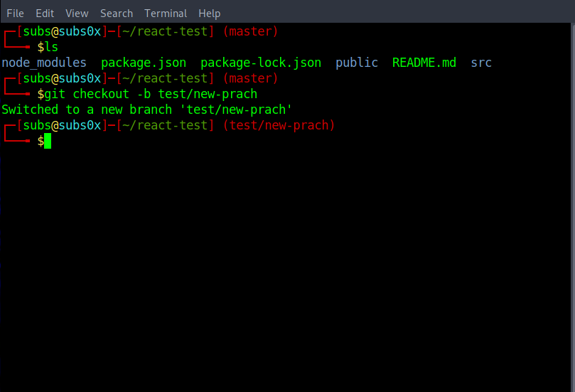

# parrot-terminal-with-git
- this is just a bashrc code 
to see this beautiful terminal effect in any linux you just need to 
1. open any code editor for example:  nano ~/.bashrc
2. paste this bashrc code from <a href='./.bashrc' > here </a>
3. save it 
4. source ~/.bashrc
5. and boom

## Screenshot

